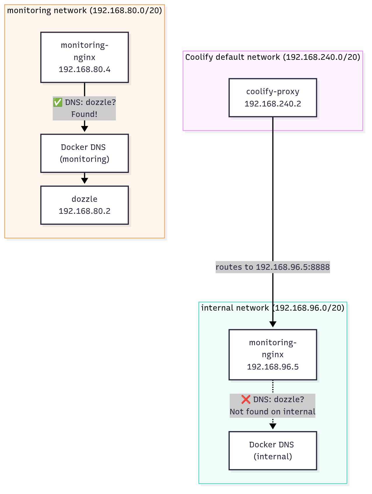

# Debugging a 504 Gateway Timeout: When Docker Multi-Network DNS Strikes

**Date:** 2026-06-22
**Tags:** `docker`, `networking`, `dns`, `traefik`, `nginx`, `debugging`

---

## The Observation

It started with a simple check: the monitoring dashboard was down. Our Dozzle container logs viewer — which we rely on daily — was returning a **504 Gateway Timeout**. Here's what the access log showed:

```
86.250.65.182 - - [21/Jun/2026:21:03:59 +0000]
  "GET /dozzle/ HTTP/3.0" 504 15 "-" "-" 20760
  "https-0-ueuosv4cq32p3zybvy8i24ju-monitoring-nginx@docker"
  "http://192.168.96.5:8888" 30003ms
```

Key observations from this single line:

- **504 Gateway Timeout** — the upstream never responded within the timeout window.
- **30003ms** — roughly 30 seconds, the default timeout before giving up.
- **Upstream target:** `http://192.168.96.5:8888` — an IP on the `192.168.96.0/20` subnet.
- **Client:** Traefik (Coolify's proxy), acting as the external reverse proxy.

The Traefik logs confirmed the worst:

```json
{
  "level": "debug",
  "error": "dial tcp 192.168.96.5:8888: i/o timeout",
  "time": "2026-06-21T21:05:00Z",
  "caller": ".../proxy.go:121",
  "message": "504 Gateway Timeout"
}
```

The TCP connection itself was timing out. The port wasn't accepting connections.

---

## The Architecture

Before diving into the fix, let's understand the request flow:

```
Client ──► Traefik (Coolify proxy) ──► monitoring-nginx (:8888) ──► dozzle (:8080)
                                                                 └──► prometheus (:9090)
```

Our infrastructure uses:

- **Traefik** as the edge reverse proxy (managed by Coolify)
- **monitoring-nginx** as an internal Nginx that adds basic auth and routes to monitoring tools
- **Dozzle** for real-time Docker container logs
- **Prometheus** for metrics

The Nginx config proxied to upstream services by Docker service name:

```nginx
location /dozzle/ {
    proxy_pass http://dozzle:8080/dozzle/;
}
```

---

## The Investigation

### First Hypothesis: Dozzle crashed

The most obvious suspect: Dozzle itself was down. Maybe an OOM kill, maybe a permission issue with `/var/run/docker.sock`. But `docker ps` showed Dozzle was running fine. Its logs showed no errors.

### Second Hypothesis: monitoring-nginx crashed

Same story — Nginx was up, accepting connections, no errors in its logs.

### Third Hypothesis: Docker network issue

This is where it got interesting. We inspected the Docker networks and found **three** networks, not two:

```
$ sudo docker network ls
NETWORK ID     NAME
288f0d1a41ff   ueuosv4cq32p3zybvy8i24ju_monitoring
bf18e46dfd36   ueuosv4cq32p3zybvy8i24ju_internal
4676187d6155   ueuosv4cq32p3zybvy8i24ju
```

Let's look at each one.

#### Network 1: `monitoring` (`192.168.80.0/20`)

```json
{
    "Name": "ueuosv4cq32p3zybvy8i24ju_monitoring",
    "Driver": "bridge",
    "IPAM": { "Subnet": "192.168.80.0/20" },
    "Internal": false,
    "Containers": {
        "dozzle":       "192.168.80.2/20",
        "prometheus":   "192.168.80.3/20",
        "monitoring-nginx": "192.168.80.4/20",
        "backend":      "192.168.80.5/20"
    }
}
```

#### Network 2: `internal` (`192.168.96.0/20`)

```json
{
    "Name": "ueuosv4cq32p3zybvy8i24ju_internal",
    "Driver": "bridge",
    "IPAM": { "Subnet": "192.168.96.0/20" },
    "Internal": true,
    "Containers": {
        "postgres":          "192.168.96.3/20",
        "redis":             "192.168.96.4/20",
        "monitoring-nginx":  "192.168.96.5/20",
        "rabbitmq":          "192.168.96.2/20",
        "scheduler-worker":  "192.168.96.6/20",
        "ai-worker":         "192.168.96.7/20",
        "backend":           "192.168.96.8/20",
        "frontend":          "192.168.96.9/20"
    }
}
```

#### Network 3: Coolify's default network (`192.168.240.0/20`)

```json
{
    "Name": "ueuosv4cq32p3zybvy8i24ju",
    "Driver": "bridge",
    "IPAM": { "Subnet": "192.168.240.0/20" },
    "Internal": false,
    "Attachable": true,
    "Containers": {
        "coolify-proxy":     "192.168.240.2/20",
        "dozzle":            "192.168.240.3/20",
        "prometheus":        "192.168.240.4/20",
        "redis":             "192.168.240.5/20",
        "rabbitmq":          "192.168.240.6/20",
        "postgres":          "192.168.240.7/20",
        "monitoring-nginx":  "192.168.240.8/20",
        "scheduler-worker":  "192.168.240.9/20",
        "ai-worker":         "192.168.240.10/20",
        "backend":           "192.168.240.11/20",
        "frontend":          "192.168.240.12/20"
    }
}
```

### The Critical Discovery

Look at `monitoring-nginx`. It's on **all three networks**:

| Network | IP Address |
|---------|-----------|
| `monitoring` | `192.168.80.4` |
| `internal` | `192.168.96.5` |
| Coolify default | `192.168.240.8` |

Now look at `dozzle`. It's on **two** networks:

| Network | IP Address |
|---------|-----------|
| `monitoring` | `192.168.80.2` |
| Coolify default | `192.168.240.3` |

But critically, `dozzle` is **NOT on the `internal` network**.

Now look at the Traefik log again:

```
"http://192.168.96.5:8888"
```

That IP — `192.168.96.5` — is `monitoring-nginx`'s address on the **`internal`** network. Traefik (the Coolify proxy on `192.168.240.2`) routed the request to `monitoring-nginx` via its `internal` network interface.

### The "Aha!" Moment

The user reported:

> monitoring-nginx is on two networks: internal and monitoring. Coolify added another network that is external, and on each network, monitoring-nginx has a different IP address. In the logs provided, Traefik required the IP address of internal, but dozzle is in monitoring network.

This was the key insight.

---

## Root Cause: Docker's Per-Network DNS Scope

Docker's embedded DNS server resolves container hostnames **per-network**. When a container is attached to multiple networks, it gets a separate DNS resolver context for each one. The DNS resolution is scoped to the network the request **arrives on**.

Here's what was happening step by step:

1. **Traefik** (on `192.168.240.2`) routes the request to `monitoring-nginx` via its **`internal`** network IP (`192.168.96.5:8888`).
2. The request arrives at Nginx on the `internal` network interface.
3. Nginx tries to resolve `dozzle` via Docker DNS.
4. **Docker DNS scopes the query to the `internal` network** — the network the TCP connection came in on.
5. `dozzle` is **not on the `internal` network** — it's only on `monitoring` and the Coolify default network.
6. DNS resolution fails → Nginx can't connect → TCP connection timeout → **504 Gateway Timeout**.



### Why It Was Intermittent

If the request happened to arrive via the `monitoring` network interface instead (e.g., if Traefik resolved the `192.168.80.4` IP), DNS resolution would work fine. This explains why the issue might have seemed flaky — it depended on which IP Traefik happened to use for routing.

### The `backend` Container Was Also Affected

Notice that `backend` is also on both `internal` and `monitoring` networks. If `backend` ever needed to reach `dozzle` or `prometheus` by hostname, it would face the same issue depending on which network the request originated from.

---

## The Fix: One Network to Rule Them All

The solution was to consolidate everything onto a single `internal` network. This is actually what our development Docker Compose file (`docker-compose.yml`) already did correctly — all services including monitoring were on the default network with no explicit network isolation.

The changes in `docker-compose.coolify.pull.yml`:

```diff
  prometheus:
    networks:
-     - monitoring
+     - internal

  dozzle:
    networks:
-     - monitoring
+     - internal

  monitoring-nginx:
    networks:
-     - internal
-     - monitoring
+     - internal

networks:
  internal:
    driver: bridge
    internal: true
- monitoring:
-   driver: bridge
```

### Why This Works

With all services on the same `internal` network:

1. **Docker DNS can resolve any service name from any container.** No more scoping ambiguity.
2. **There's no ambiguity about which network a DNS query belongs to.** Every container has exactly one DNS context.
3. **The `internal: true` flag still provides network isolation** — no external access to these containers from the host. This is the same security property the `monitoring` network provided.

### Why Not Keep Two Networks?

You might ask: "Couldn't we just add `dozzle` and `prometheus` to the `internal` network too, keeping both networks?"

Yes, that would also fix the DNS issue. But having two separate bridge networks with the same isolation properties adds **unnecessary complexity** with **zero security benefit**. A single `internal` network is simpler, easier to reason about, and eliminates this class of bug entirely.

### What About the Coolify Default Network?

The Coolify default network (`192.168.240.0/20`) is automatically created by Coolify and attaches all containers for Traefik routing. We didn't touch this — it's managed by Coolify and necessary for the proxy to reach services. The key fix was ensuring that `dozzle` and `prometheus` are on the `internal` network so that `monitoring-nginx` can resolve them via DNS regardless of which interface the request arrives on.

---

## Lessons Learned

### 1. Docker DNS is per-network

This is the most important takeaway. When a container is on multiple networks, Docker's embedded DNS resolves hostnames **only within the network context of the incoming request**. A container cannot resolve hostnames from another network, even if it's attached to both.

### 2. Multi-network containers have multiple personalities

A container on two networks has two IP addresses, two DNS contexts, and potentially different routing behavior depending on which interface a request arrives on. This can lead to subtle, hard-to-reproduce bugs. In our case, `monitoring-nginx` had **three** IP addresses:

```
monitoring-nginx:
  internal:   192.168.96.5
  monitoring: 192.168.80.4
  coolify:    192.168.240.8
```

Each one behaves differently for DNS resolution.

### 3. The `gzip` errors were a red herring

The Traefik logs also showed:

```json
{
  "level": "debug",
  "middlewareName": "gzip@docker",
  "error": "mime: no media type",
  "message": "Unable to parse MIME type"
}
```

These were **symptoms**, not causes. Traefik was trying to compress responses that had no `Content-Type` header — which happens when the upstream returns an empty response or the connection is already dead. Always look past the noise to find the real signal.

### 4. Logs tell a story if you read them together

The access log showed the 504 and the upstream IP (`192.168.96.5`). The Traefik log showed the `i/o timeout`. The Docker network inspection showed which containers were on which networks. Each piece alone was confusing — together, they told the complete story.

### 5. `docker inspect` is your best friend for network debugging

The `docker inspect` command on a network shows you exactly which containers are attached and their IP addresses. Cross-referencing this with your reverse proxy logs is the fastest way to spot network scoping issues.

---

## The Debugging Checklist

If you encounter a similar 504 with Docker and a reverse proxy, here's a systematic approach:

1. **Check if the upstream container is running**
   ```bash
   docker ps --filter name=dozzle
   ```

2. **Check the upstream container's logs**
   ```bash
   docker logs <container-id> --tail 50
   ```

3. **Check the reverse proxy's logs** for upstream errors
   ```bash
   docker logs <traefik-or-nginx-id> --tail 50
   ```

4. **Verify network connectivity** from the proxy to the upstream
   ```bash
   docker exec <proxy-container> curl -v http://upstream-service:port/
   ```

5. **List all Docker networks**
   ```bash
   docker network ls
   ```

6. **Inspect each network** to see which containers are attached
   ```bash
   docker inspect <network-name>
   ```
   Look at the `Containers` section — this shows every container on that network and its IP address.

7. **Cross-reference IPs with your logs** — if the proxy is hitting one IP but the upstream isn't on that network, you've found the problem.

8. **If multi-network, suspect DNS scoping** — this is almost always the culprit.

---

## Conclusion

A 504 Gateway Timeout is rarely about the timeout itself — it's about what's preventing the upstream from responding. In our case, it was a Docker DNS scoping issue caused by splitting services across two networks. The fix was simple: consolidate onto a single network.

The next time you see a 504, don't just check if the service is running. Check **which network** it's running on, and whether the proxy can actually find it. Run `docker inspect` on your networks — the answer is often hiding in plain sight.
