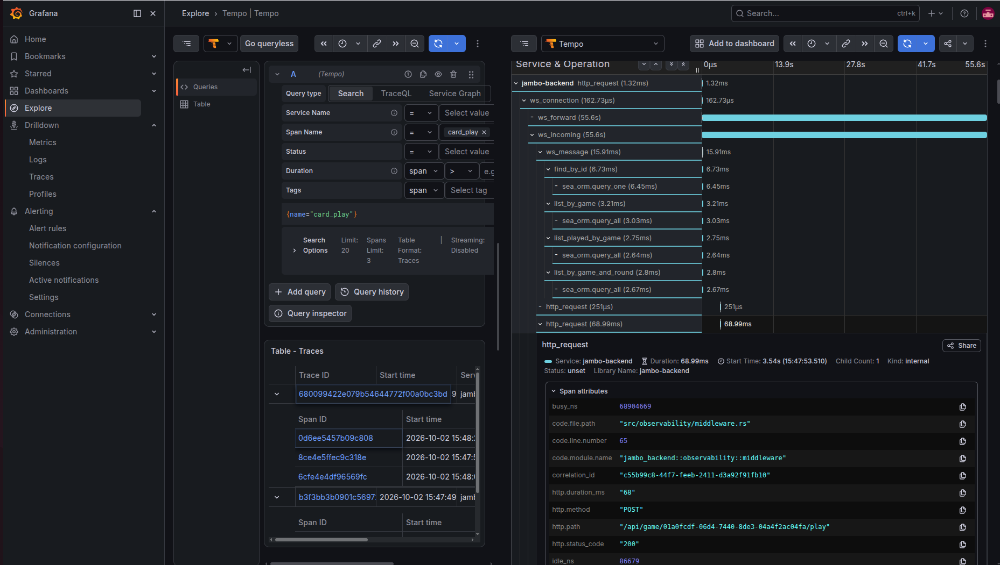

# Solid Observability in a Rust API: OpenTelemetry Traces, Prometheus Metrics, and Loki Logs

**Date:** 2026-09-25
**Tags:** `observability`, `opentelemetry`, `tracing`, `prometheus`, `loki`, `tempo`, `grafana`, `rust`, `actix-web`

---

Hello,

I've been working on a project with a Rust API server and wanted to share how I implemented some solid observability.

I wanted to build a foundation where I could actually see what happens in production — not just `println!` or grepping through container logs, but something solid. So I ended up implementing OpenTelemetry for traces, Prometheus for metrics, and Loki for logs, and I thought I'd share how I did it. Hopefully someone finds it useful!

## Stack

- **`opentelemetry` 0.32** + **`opentelemetry_sdk` 0.32** + **`opentelemetry-otlp` 0.32**
- **`tracing`** + **`tracing-subscriber`** + **`tracing-opentelemetry` 0.33**
- **`opentelemetry-appender-tracing` 0.32**
- **Tempo** for traces
- **Prometheus** for metrics
- **Loki** + **Promtail** for logs
- **Grafana** to view everything

Here's the relevant slice of `Cargo.toml`:

```toml
opentelemetry = { version = "0.32", features = ["trace", "metrics", "logs"] }
opentelemetry_sdk = { version = "0.32", features = ["trace", "metrics", "logs", "rt-tokio"] }
opentelemetry-otlp = { version = "0.32", features = ["grpc-tonic", "trace", "metrics", "logs"] }
opentelemetry-appender-tracing = "0.32"
tracing = { version = "0.1", features = ["log"] }
tracing-subscriber = { version = "0.3", features = ["env-filter", "json"] }
tracing-opentelemetry = "0.33"
prometheus = "0.13"
```

## How it works

The app exports **traces** via OTLP/gRPC directly to Tempo. **Metrics** are exposed on a `/metrics` endpoint that Prometheus scrapes. **Logs** are collected from the Docker containers by Promtail and pushed to Loki. Grafana connects to all three as datasources.

```
App ──(OTLP/gRPC :4317)──► Tempo ──(remote_write)──► Prometheus
App ──(/metrics scrape)──────────────────────────────► Prometheus
Docker logs ──► Promtail ──► Loki

Grafana ──► Tempo (traces)
        ──► Prometheus (metrics)
        ──► Loki (logs)
```

Tempo's metrics generator also derives service-graph and span metrics from the traces and remote-writes them into Prometheus, so the same trace data feeds both the trace view and the metrics view (`tempo-config.yml`):

```yaml
metrics_generator:
  processor:
    service_graphs: {}   # service graph metrics
    span_metrics:        # RED metrics derived from spans
      enable_target_info: true
  storage:
    remote_write:
      - url: http://prometheus:9090/api/v1/write
        send_exemplars: true
```

Prometheus scrapes each binary's `/metrics` endpoint (`prometheus.yml`):

```yaml
scrape_configs:
  - job_name: "jambo-backend"
    static_configs:
      - targets: ["backend:5000"]
    metrics_path: /metrics

  - job_name: "jambo-ai-worker"
    static_configs:
      - targets: ["ai-worker:7000"]
    metrics_path: /metrics

  - job_name: "jambo-scheduler-worker"
    static_configs:
      - targets: ["scheduler-worker:6000"]
    metrics_path: /metrics
```

## Tracing setup

On startup I initialize a `TracerProvider` with an OTLP span exporter and wire it into the `tracing` subscriber as a layer. This lives in `init_tracing()`:

```rust
pub fn init_tracing(service_name: &str) {
    let otlp_endpoint =
        std::env::var("OTEL_EXPORTER_OTLP_ENDPOINT").unwrap_or_else(|_| "http://tempo:4317".into());

    let exporter = SpanExporter::builder()
        .with_tonic()
        .with_endpoint(&otlp_endpoint)
        .build()
        .expect("Failed to build OTLP span exporter");

    let provider = SdkTracerProvider::builder()
        .with_batch_exporter(exporter)
        .with_resource(
            Resource::builder()
                .with_service_name(service_name.to_string())
                .build(),
        )
        .build();

    let tracer = provider.tracer(service_name.to_string());
    let telemetry_layer = tracing_opentelemetry::layer().with_tracer(tracer);

    let env_filter = tracing_subscriber::EnvFilter::try_from_default_env()
        .unwrap_or_else(|_| tracing_subscriber::EnvFilter::new("info"));

    tracing_subscriber::registry()
        .with(env_filter)
        .with(tracing_subscriber::fmt::layer().json())
        .with(telemetry_layer)
        .init();

    opentelemetry::global::set_tracer_provider(provider);
    opentelemetry::global::set_text_map_propagator(
        opentelemetry_sdk::propagation::TraceContextPropagator::new(),
    );
}
```

A few things worth calling out:

- The exporter uses **`with_tonic()`** (gRPC) and points at Tempo's OTLP receiver on `:4317`.
- **`with_batch_exporter`** batches spans instead of exporting one-by-one, which keeps the hot path cheap.
- The **`Resource`** carries the service name, so every span is tagged with which binary produced it (`backend`, `ai-worker`, `scheduler-worker`).
- The **`TraceContextPropagator`** is installed globally so W3C `traceparent`/`tracestate` headers can be injected and extracted across process boundaries.
- The subscriber keeps a **JSON fmt layer** for stdout *and* the OpenTelemetry layer, so logs stay greppable locally while spans flow to Tempo.

## HTTP request spans

Every request goes through a middleware that creates a span and records the outcome. The span is created up front with `Empty` fields, then those fields are filled in after the response is produced (`middleware.rs`):

```rust
let span = tracing::info_span!(
    "http_request",
    correlation_id = %correlation_id,
    http.method = %method,
    http.path = %path,
    http.status_code = tracing::field::Empty,
    http.duration_ms = tracing::field::Empty,
    http.error_message = tracing::field::Empty,
);
```

The middleware also accepts an incoming `X-Request-Id` or `X-Correlation-Id` header (or generates a fresh UUID), stores it in request extensions so handlers can read it, and echoes it back on the response as `x-request-id`.

After the future resolves, the fields are recorded while the span is still active:

```rust
let _guard = span.enter();
let result = fut.await;
let duration = start.elapsed();

span.record("http.duration_ms", duration.as_millis() as u64);
span.record("http.status_code", status_code);
```

One subtlety: I enter the span manually with `span.enter()` rather than using `.instrument()` on the future. With `.instrument()` the span is exited before I get a chance to `record()` the status code and duration, so the fields would stay empty. Entering manually keeps the span active across the `await` and the subsequent `record()` calls.

### Keeping cardinality under control

The raw path contains IDs (`/api/game/8f3c.../play`), which would explode the number of distinct metric label values. So before recording metrics, the middleware normalizes UUID path segments to `{id}`:

```rust
let path_segments: Vec<&str> = path.split('/').collect();
let normalized_path = if path_segments.len() >= 4 && path_segments[1] == "api" {
    let parts: Vec<&str> = path_segments
        .iter()
        .map(|seg| {
            if Uuid::parse_str(seg).is_ok() {
                "{id}"
            } else {
                seg
            }
        })
        .collect();
    parts.join("/").to_string()
} else {
    path.clone()
};
```

So `/api/game/8f3c.../play` becomes `/api/game/{id}/play`, and the label space stays bounded.

## Metrics: the RED method

Metrics use the `prometheus` crate directly. The two core HTTP metrics are a counter and a histogram (`metrics.rs`):

```rust
pub static HTTP_REQUESTS_TOTAL: Lazy<CounterVec> = Lazy::new(|| {
    register_counter_vec!(
        "http_requests_total",
        "Total number of HTTP requests",
        &["method", "path", "status"]
    )
    .unwrap()
});

pub static HTTP_REQUEST_DURATION_SECONDS: Lazy<HistogramVec> = Lazy::new(|| {
    register_histogram_vec!(
        "http_request_duration_seconds",
        "HTTP request duration in seconds",
        &["method", "path"],
        vec![0.005, 0.01, 0.025, 0.05, 0.1, 0.25, 0.5, 1.0, 2.5, 5.0, 10.0]
    )
    .unwrap()
});
```

After each request completes, the middleware records **rate** and **duration**:

```rust
metrics::HTTP_REQUESTS_TOTAL
    .with_label_values(&[method_str, &normalized_path, &status_code.to_string()])
    .inc();

metrics::HTTP_REQUEST_DURATION_SECONDS
    .with_label_values(&[method_str, &normalized_path])
    .observe(duration.as_secs_f64());
```

That gives the **R**ate and **D**uration of the RED method. For **E**rrors, the status code is already a label on `http_requests_total`, so you can slice it in PromQL:

```promql
# error rate
sum(rate(http_requests_total{status=~"5.."}[5m]))
  / sum(rate(http_requests_total[5m]))

# p95 latency by route
histogram_quantile(
  0.95,
  sum(rate(http_request_duration_seconds_bucket[5m])) by (le, path)
)
```

Beyond HTTP, the same pattern covers the rest of the system: game lifecycle, AI task duration, bot errors, scheduler task health, database pool gauges, Redis cache hit ratio, and payment operations. There are dedicated counters for the things that tend to fail silently — `bot_chain_fallback_total`, `games_stalled_total`, `redis_buffer_overflow_total`, `circuit_breaker_state`.

### Pre-registering series

One gotcha with the `prometheus` crate: a `CounterVec`/`HistogramVec` with no observed label combination exports nothing, so a dashboard panel or alert referencing it shows "no data" until the first event happens. To avoid that, `metrics_init::init_all()` touches every metric with its known label values at startup:

```rust
pub fn init_all() {
    HTTP_REQUESTS_TOTAL.with_label_values(&["GET", "/health", "200"]);
    HTTP_REQUEST_DURATION_SECONDS.with_label_values(&["GET", "/health"]);
    GAMES_FINISHED_TOTAL.with_label_values(&["finished"]);
    AI_TASK_DURATION_SECONDS.with_label_values(&["ai_task"]);
    // ... every other metric + label combination
}
```

Now every series exists from boot, and alerts don't fire on missing data.

## Propagating traces across RabbitMQ

The interesting part of this system is that a card play can hop from the API process to the AI worker process. To keep it one trace, the trace context is injected into the AMQP message headers when publishing, and extracted on the consumer side.

The injector/extractor wrap a lapin `FieldTable` (`propagation.rs`):

```rust
pub struct AmqpInjector<'a>(pub &'a mut FieldTable);

impl Injector for AmqpInjector<'_> {
    fn set(&mut self, key: &str, value: String) {
        self.0.insert(key.into(), AMQPValue::LongString(value.into()));
    }
}

pub struct AmqpExtractor<'a>(pub &'a FieldTable);

impl Extractor for AmqpExtractor<'_> {
    fn get(&self, key: &str) -> Option<&str> {
        self.0.inner().get(key).and_then(|value| match value {
            AMQPValue::LongString(s) => std::str::from_utf8(s.as_bytes()).ok(),
            _ => None,
        })
    }
    // ...
}
```

Injection uses the **current tracing span's** context, not the ambient `Context::current()`:

```rust
pub fn inject_headers() -> FieldTable {
    let parent_cx = tracing::Span::current().context();
    let mut headers = FieldTable::default();
    opentelemetry::global::get_text_map_propagator(|propagator| {
        propagator.inject_context(&parent_cx, &mut AmqpInjector(&mut headers));
    });
    headers
}
```

This is deliberate: the `tracing-opentelemetry` layer isn't configured with context activation, so `Context::current()` wouldn't be the span's context. Pulling it off `Span::current()` is what actually gives you the right `traceparent`.

On the consumer side, the worker extracts the context from the delivery headers and links its span to it:

```rust
let parent_context = propagation::extract_context(delivery.properties.headers());
let result = process_bot_move(task, db, redis, Some(rmq), parent_context).await;
```

And inside `process_bot_move`, the new span is parented to that extracted context (`worker_core.rs`):

```rust
let span = tracing::info_span!(
    "ai_task",
    correlation_id = %correlation_id.map(|id| id.to_string()).unwrap_or_default(),
    game_id = %game_id,
    player_id = %player_id,
);
// Link this span into the producer's trace (distributed context from the message headers).
let _ = span.set_parent(parent_context);
let _guard = span.enter();
```

Now the HTTP request and the bot's move show up as a single trace in Tempo, even though they ran in different processes.

## A trace from a card play

Here's what a single card play looks like end to end. The client calls `POST /api/game/{id}/play`, and the trace threads through both processes.

**1. HTTP entry.** The middleware opens the `http_request` span with the correlation ID, method, and path.

**2. Handler.** `play_card` pulls the correlation ID out of request extensions and calls the service:

```rust
let correlation_id = req.extensions().get::<CorrelationId>().copied();

match orchestrator
    .play_card(game_id, payload.player_id, payload.card_index, correlation_id, idempotency_key)
    .await
{ /* ... */ }
```

**3. Service.** `GamePlayService::play_card` is instrumented, so it produces its own span with the game, player, and card index:

```rust
#[tracing::instrument(
    level = "info",
    skip(self),
    fields(
        correlation_id = %correlation_id.map(|c| c.to_string()).unwrap_or_default(),
        game_id = %game_id,
        player_id = %player_id,
        card_index = card_index
    )
)]
async fn play_card(/* ... */) -> Result<PlayCardOutcome, GameError> { /* ... */ }
```

**4. Card play.** `update_card_play` opens a `card_play` span and runs the whole thing inside a transaction with optimistic-lock retries:

```rust
let _timer = CardPlayTimer(Instant::now());
let span = tracing::info_span!(
    "card_play",
    correlation_id = %correlation_id.map(|id| id.to_string()).unwrap_or_default(),
    game_id = %game_id,
    player_id = %player_id,
    card_index = card_index,
);
let _guard = span.enter();
```

The `CardPlayTimer` guard records into `card_play_duration_seconds` when it drops, so the metric and the span line up.

**5. Bot scheduling.** If the next player is a bot, `schedule_if_next_bot` builds an AI task and publishes it:

```rust
#[tracing::instrument(
    level = "info",
    skip(self),
    fields(
        correlation_id = %correlation_id.map(|c| c.to_string()).unwrap_or_default(),
        game_id = %game_id,
        next_player = %next_player
    )
)]
pub async fn schedule_if_next_bot(/* ... */) { /* ... */ }
```

**6. Publish with context.** `publish_ai_task` opens a `publish_ai_task` span and injects the trace headers into the message:

```rust
pub async fn publish_ai_task(&self, task: &AITask) -> Result<(), lapin::Error> {
    let span = tracing::info_span!(
        "publish_ai_task",
        correlation_id = %task.correlation_id.map(|id| id.to_string()).unwrap_or_default(),
        game_id = %task.game_id,
        player_id = %task.player_id,
    );
    let _guard = span.enter();
    let headers = crate::observability::propagation::inject_headers();
    self.publish_with_retry(AI_TASKS_QUEUE, &task.to_json_bytes(), headers)
        .await
}
```

**7. Worker picks it up.** The AI worker extracts the parent context from the headers and processes the task, producing the `ai_task` span parented to the original trace. It then calls `update_card_play` again for the bot's move — which opens another `card_play` span, still inside the same trace.

The result is a waterfall that spans both processes: `http_request` → `play_card` → `card_play` → `schedule_if_next_bot` → `publish_ai_task` → `ai_task` → `card_play`. If the bot's move stalls, you can see exactly which span is slow or missing.



## What this gives you

- **Traces** that cross process boundaries, so a request that touches the API, RabbitMQ, and the AI worker is one waterfall instead of three disconnected log streams.
- **Metrics** with bounded cardinality, pre-registered at boot, covering HTTP RED plus game, bot, scheduler, DB pool, Redis, and payment health.
- **Logs** aggregated centrally, queryable with LogQL across every service.
- **Correlation** in Grafana: spot a latency spike on a Prometheus panel, jump to the time range in Loki, find the correlation ID, then open the full trace in Tempo.

<!-- ## Honest limitations

- `init_tracing()` currently sets up the **tracer provider only**. The `metrics` and `logs` features are enabled on the OTel crates, but metrics are served through the `prometheus` crate and logs go to stdout (collected by Promtail), so there's no OTLP metrics or logs pipeline yet.
- Trace context propagation is implemented for **HTTP and AMQP**. Redis Pub/Sub events carry the correlation ID as a field but don't yet carry W3C trace context.
- Tempo is configured with short local retention, which is fine for a side project but would need object storage for anything longer.

I'm planning to write up more of the surrounding pieces — rate limiting, the Docker setup, and running multiple API instances — as separate posts. -->
