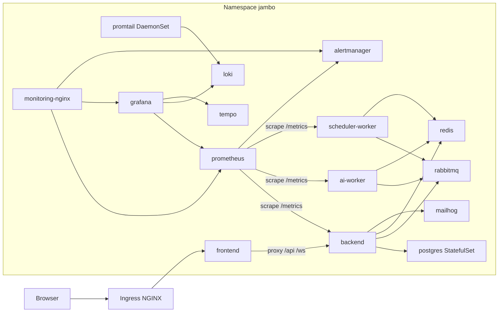

# Deployment Guide

This document describes how to launch the Jambo stack in two environments:

1. **Local** — a single-node [minikube](https://minikube.sigs.k8s.io/) cluster.
2. **Production** — a real Kubernetes cluster, using the CI-built images from
   GitHub Container Registry (GHCR).

Both environments use the **same Kubernetes manifests** under [`k8s/`](../k8s/)
(see [`k8s/README.md`](../k8s/README.md) for the directory layout). The backend
is fully environment-variable driven ([`backend/src/config.rs`](../backend/src/config.rs))
and runs database migrations automatically on startup
([`backend/src/bootstrap.rs`](../backend/src/bootstrap.rs)), so no application
code changes are required to move between environments.

---

## Architecture (Kubernetes)



Key facts that shape the manifests:

- The frontend nginx already proxies `/api` and `/ws` to `backend:5000`
  ([`frontend/nginx.conf`](../frontend/nginx.conf)), so the Ingress only needs
  to route everything to the frontend Service.
- The backend binds to `config.host:config.port` (default `127.0.0.1:5000`).
  In Kubernetes the ConfigMap sets `HOST=0.0.0.0`.
- Prometheus scrapes `backend:5000`, `ai-worker:7000`, and
  `scheduler-worker:6000` — the workers expose metrics on `PORT+2000` and
  `PORT+1000` respectively, so they need Services, not just Deployments.
- Services talk to each other by Kubernetes Service DNS names.

---

## 1. Local (minikube)

### Prerequisites

- [minikube](https://minikube.sigs.k8s.io/docs/start/)
- [kubectl](https://kubernetes.io/docs/tasks/tools/)
- Docker

### One-shot launch

```bash
scripts/minikube-up.sh local
```

This script:

1. Starts minikube with the `ingress` addon (4 CPUs, 8 GiB).
2. Builds the `jambo-*:local` images directly into minikube's Docker cache.
3. Creates the `jambo` namespace and the `prometheus-alerts` ConfigMap.
4. Applies `k8s/overlays/local` via Kustomize.
5. Waits for the backend rollout (migrations run on startup).
6. Adds `jambo.local` to `/etc/hosts`.

Then open **http://jambo.local**.

### Verifying the stack

```bash
# All pods Running/Ready
kubectl -n jambo get pods

# Backend health (migrations completed)
kubectl -n jambo port-forward svc/backend 5000:5000
curl http://localhost:5000/health        # -> OK

# Backend reachable through the frontend proxy
curl http://jambo.local/api/anonymous

# Monitoring UI (Prometheus / Grafana / Alertmanager) via the ingress
curl http://monitoring.jambo.local/prometheus/
curl http://monitoring.jambo.local/grafana/
curl http://monitoring.jambo.local/alertmanager/

# Prometheus targets
kubectl -n jambo port-forward svc/prometheus 9090:9090
# open http://localhost:9090/prometheus/targets

# MailHog (captured emails)
minikube service mailhog -n jambo
```

### Local-build troubleshooting

- **`minikube docker-env` is shell-scoped.** Each new terminal needs
  `eval "$(minikube docker-env)"` before `docker build` targets minikube's
  cache. With the containerd runtime, use
  `minikube image build -t jambo-<name>:local -f <Dockerfile> <context>` (or
  `minikube image load`) instead.
- **`/etc/hosts` needs the ingress hosts.** The Ingress uses host rules; add
  `127.0.0.1 jambo.local api.jambo.local monitoring.jambo.local` manually
  if the script could not.

---

## 2. Production (Kubernetes)

Production uses the **GHCR overlay** (`k8s/overlays/ghcr`), which pulls the
images built by CI (`.github/workflows/deploy.yml`) from
`ghcr.io/jtombiamba/rust_jambo-<name>:latest`. This is the closest-to-CI path.

### Prerequisites

- A Kubernetes cluster (managed or self-hosted) with the
  [ingress-nginx](https://kubernetes.github.io/ingress-nginx/) controller
  installed and a StorageClass for PVCs.
- `kubectl` configured against the cluster.
- `kustomize` (or `kubectl kustomize`, bundled with kubectl ≥ 1.14).
- Read access to the private GHCR packages.

### 1. Create the namespace and image pull secret

```bash
kubectl create namespace jambo

kubectl -n jambo create secret docker-registry ghcr-pull \
  --docker-server=ghcr.io \
  --docker-username=<github-user> \
  --docker-password=<github-pat-with-read:packages>
```

### 2. Configure secrets (do not commit real values)

No secret values are committed to the repository. The base manifests reference
Secret objects by name (`jambo-secrets`, `monitoring-nginx-secrets`,
`alertmanager-secrets`) but do **not** declare them — they are created at deploy
time. The keys are documented in
[`k8s/base/secret.yaml.example`](../k8s/base/secret.yaml.example).

For production, create the secrets with real values (or use a secret store such
as Sealed Secrets / External Secrets / Vault):

```bash
kubectl -n jambo create secret generic jambo-secrets \
  --from-literal=JWT_SECRET='<random-64-hex>' \
  --from-literal=JWT_EXPIRY_HOURS='24' \
  --from-literal=IP_HASH_PEPPER='<random-pepper>' \
  --from-literal=PAYPAL_CLIENT_ID='<paypal-client-id>' \
  --from-literal=PAYPAL_CLIENT_SECRET='<paypal-client-secret>' \
  --from-literal=BENCHMARK_API_TOKEN='<benchmark-token>' \
  --dry-run=client -o yaml | kubectl apply -f -

kubectl -n jambo create secret generic monitoring-nginx-secrets \
  --from-literal=PROMETHEUS_USER='<user>' \
  --from-literal=PROMETHEUS_PASSWORD='<password>' \
  --from-literal=GRAFANA_USER='<user>' \
  --from-literal=GRAFANA_PASSWORD='<password>' \
  --dry-run=client -o yaml | kubectl apply -f -

kubectl -n jambo create secret generic alertmanager-secrets \
  --from-literal=SLACK_CRITICAL_WEBHOOK_URL='<url>' \
  --from-literal=SLACK_WARNING_WEBHOOK_URL='<url>' \
  --from-literal=SMTP_USERNAME='<user>' \
  --from-literal=SMTP_PASSWORD='<password>' \
  --dry-run=client -o yaml | kubectl apply -f -
```

> Never commit production secrets. The local bring-up script
> ([`scripts/minikube-up.sh`](../scripts/minikube-up.sh)) creates these secrets
> automatically from the gitignored `.env` file, generating random values for
> any missing key.

Also update `k8s/base/configmap.yaml` for production values such as
`FRONTEND_URL`, `CORS_ALLOWED_ORIGINS`, `MAILER_MODE`/`SMTP_*` (a real SMTP
relay instead of MailHog), and `PAYPAL_MODE`.

### 3. Generate the Prometheus alerts ConfigMap

```bash
kubectl -n jambo create configmap prometheus-alerts \
  --from-file=alerts.yml=infra/prometheus/alerts.yml \
  --dry-run=client -o yaml | kubectl apply -f -
```

> Required — Prometheus refuses to start without `/etc/prometheus/alerts.yml`.

### 4. Apply the GHCR overlay

```bash
kubectl apply -k k8s/overlays/ghcr
kubectl -n jambo rollout status deployment/backend --timeout=300s
```

### 5. Configure DNS / TLS

The base Ingress uses host `jambo.local`. For production, add your real host(s)
and TLS. For example, patch the Ingress:

```bash
kubectl -n jambo annotate ingress jambo-ingress \
  cert-manager.io/cluster-issuer=letsencrypt-prod
```

or edit `k8s/base/ingress.yaml` to use the production hostname and a
`cert-manager` TLS block, then re-apply.

### 6. Expose monitoring

The monitoring UI (`monitoring-nginx`) is served through the ingress on host
`monitoring.jambo.local` (see [`k8s/base/ingress.yaml`](../k8s/base/ingress.yaml)).
It uses HTTP basic auth for `/prometheus/` and `/alertmanager/`. In production,
point the `monitoring.jambo.local` host at your real domain and add TLS via
`cert-manager`. The basic-auth credentials come from the
`monitoring-nginx-secrets` Secret (see section 2) — never hardcode them in the
Deployment.

---

## Configuration reference

All backend/worker settings live in `k8s/base/configmap.yaml`
(`jambo-config`) and the `jambo-secrets` Secret (see section 2). The names match
the env vars read by [`backend/src/config.rs`](../backend/src/config.rs) and
[`backend/src/mailer/mod.rs`](../backend/src/mailer/mod.rs). Notable points:

- `HOST=0.0.0.0` — required so the backend is reachable from other pods.
- `DATABASE_URL`, `RABBITMQ_URL`, `REDIS_URL` use the Service DNS names
  (`postgres`, `rabbitmq`, `redis`).
- `SMTP_*` point at `mailhog:1025` for local; use a real relay in production.
- Worker metric ports are derived from `PORT`: `ai-worker` = `PORT+2000`
  (7000), `scheduler-worker` = `PORT+1000` (6000).

---

## Key design decisions

- **No application code changes** — the backend is fully env-var driven and
  auto-migrates on startup.
- **Ingress → frontend only** — the frontend nginx already proxies `/api` and
  `/ws` to the backend.
- **Kustomize base + overlays** — one set of manifests for local-build and
  GHCR-pull modes.
- **Postgres as a StatefulSet** with a PVC for durable data; the stateful LGTM
  services (Loki, Tempo, Prometheus, Alertmanager, Grafana) also use PVCs.
- **Promtail as a DaemonSet** to tail `/var/log/containers/*.log` on every node.
- **Readiness probes** on Postgres/RabbitMQ/Redis mirror the docker-compose
  healthchecks, preventing the backend from crash-looping while dependencies
  come up; the backend readiness probe (`/health`) only passes after migrations
  complete.
- **`fsGroup` on stateful observability pods** (Loki/Tempo `10001`, Grafana
  `472`, Prometheus `65534`) so non-root images can write to their PVCs.
- **Default image pull policy** — the base deliberately omits
  `imagePullPolicy`, so `local` → `IfNotPresent` and `latest` → `Always`.

## Gotchas

- `prometheus-alerts` ConfigMap is required; always create it from
  `infra/prometheus/alerts.yml` (the bring-up script does this automatically).
- `monitoring-nginx` overrides the baked `nginx.conf` to drop the `/dozzle/`
  location (Dozzle is not part of this stack; nginx fails to start if an
  upstream hostname does not resolve).
- Non-root observability images need `securityContext.fsGroup` on
  root-owned PVCs.
- The repository is private, so GHCR-pulled images need the `ghcr-pull` pull
  secret (injected by the `ghcr` overlay).
- RabbitMQ uses `guest`/`guest`; if connections are refused, use a non-guest
  user (Docker Compose/Coolify already do this, so it typically works).
